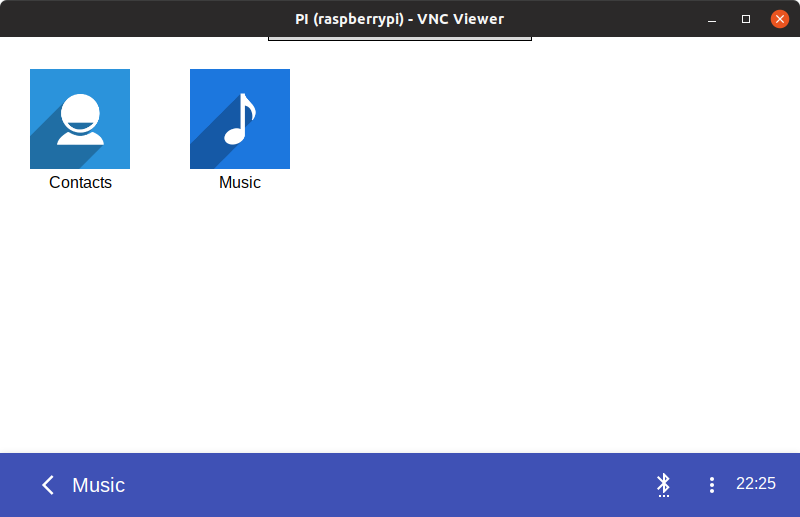
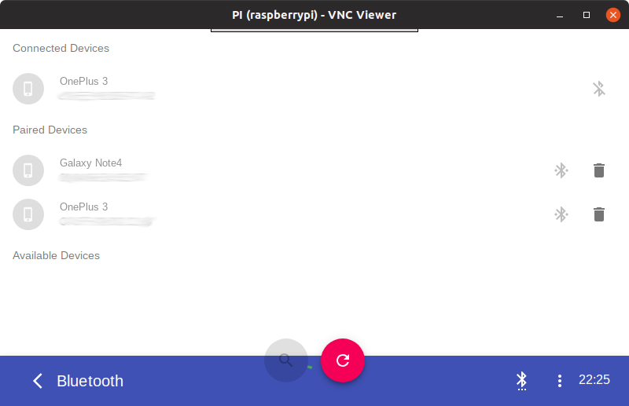

# Car Multimedia Software





## How to Start?

```
mkvirtualenv cms --python=python2
pip install -r requirements.txt -e .
```

then in one terminal run:
```
python -m car.app
```
which is the front end (currently on port 8080).

and in second terminal run the bluetooth service (port 8090):
```
python -m bluetooth_contoller.service
```

in third terminal run the agent:
```
python -m bluetooth_controller.agent
```
